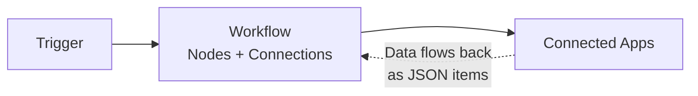

# 2. How does a workflow actually run?

The four leads from this morning are already in HubSpot. The support tickets have been Slacked. The invoices are in the finance sheet. You finish your coffee, a little stunned at how quick that was, and a little suspicious. *How did it actually do that?* You didn't click anything. You didn't watch a cursor move. From your seat it just *happened* while you were asleep.

It's worth slowing down and pulling that apart, because the rest of this book leans on the answer. Once you can see the moving parts, every chapter from here on — branching, looping, AI nodes, error handling, sub-workflows — clicks into place. They're all variations on the same picture.

## The picture

Here's the entire model. Burn this into your head, because it is the only diagram you really need:



Read it like this: something happens in the world — a new email arrives, a Typeform is submitted, the clock ticks to 7am — and that something fires a **trigger**. The trigger starts an **execution** of a **workflow** — a graph of **nodes** wired together on n8n's visual canvas. Each node receives data as **JSON items**, does one thing with it (transform, branch, write to an app, ask an AI a question), and passes its output to the next node. The workflow reaches out to **connected apps** through n8n's built-in app nodes — Gmail, Slack, HubSpot, Sheets, Stripe, your CRM — reading from them, writing to them, doing both. When the last node finishes, the execution ends, and n8n logs every step of it in the **Executions log** for you to inspect.

That loop is a workflow.

Each box has a job. Let's walk them.

## Box 1: You

You build a workflow once. Then you watch.

Your job is to *decide what should happen*, draw it on the canvas as a sequence of nodes, and activate it. Once it's running, the workflow runs without you — but you're not gone from the picture. You're in the **Executions log**, the timeline of every run the workflow has done since you activated it. Every execution there shows the data that came in at the trigger, what each node did with it, what each node passed downstream, and where (if anywhere) it failed.

That sounds passive; it isn't. The Executions log is where the actual judgment happens — *was the AI's classification right? Did the email send to the right person? Why did this one fail when the others succeeded?* You're not standing over the workflow's shoulder; you're reviewing the tape afterward. Ch. 15 covers what to do when the tape shows red.

## Box 2: The Trigger

A trigger is **the thing that decides when the workflow starts**. Every workflow has exactly one trigger as its first node. Without a trigger, nothing runs.

Triggers come in three families:

- **Schedule triggers** fire at times you specify — "every weekday at 7am", "every 15 minutes", "the first of every month". You're telling n8n *when*.
- **Webhook triggers** fire when something else calls them. n8n gives you a URL; whatever you paste it into — a Typeform "on submit", a Stripe webhook, a GitHub event, a custom button on your internal tool — that thing calls the URL, and n8n receives the data and starts the workflow. You're telling n8n *let me know when this URL gets hit*.
- **App-event triggers** fire when something changes inside a third-party app — a new email arrives in Gmail, a new row gets added to a Google Sheet, a new ticket opens in Zendesk, a deal moves stages in HubSpot. n8n has built-in triggers for hundreds of apps; you pick the event, connect the credentials, and it watches for you. You're telling n8n *wake me up when this happens in this app*.

The trigger is also where the workflow gets its **first item of data**. A Schedule trigger fires with just a timestamp. A Webhook trigger fires with whatever payload the calling app sent — the form submission, the event details, the customer record. An app-event trigger fires with the data of the thing that happened — the new email's contents, the new row's columns, the new ticket's fields.

That data is what flows into the next node, and from there into the rest of the workflow.

## Box 3: The Workflow (Nodes + Connections)

The Workflow is the part you actually build. It's a directed graph drawn on n8n's visual canvas — **nodes** are the boxes, **connections** are the lines between them, and **data flows along the lines from left to right**.

Each node is one step. A node can do one of four kinds of things:

1. **Transform** — change the shape of the data. Rename fields. Add a calculated column. Strip whitespace. Format a date. The **Set / Edit Fields** node is the workhorse here; the **AI Transform** node is the escape hatch when the transformation is too complex to do by hand.
2. **Branch** — split the workflow into different paths depending on the data. The **IF** node sends data down one of two paths; the **Switch** node sends it down one of many.
3. **Talk to an app** — read from or write to a connected app. The **Gmail** node sends an email. The **HubSpot** node creates a contact. The **Google Sheets** node appends a row. The **HTTP Request** node calls any API that doesn't have a built-in node yet (more on it in Ch. 10).
4. **Ask an AI** — the **AI Agent** node sends data to an LLM with a system prompt and gets structured output back. Cluster nodes like **Text Classifier**, **Sentiment Analysis**, and **Information Extractor** handle the most common AI sub-tasks without you writing a prompt from scratch.

The connections between nodes carry the data downstream. When you click a node *after* a successful execution, n8n shows you exactly what data came in and what data went out — the green columns on the left, the green columns on the right, every field visible. This is the single most important debugging surface in the entire tool: you don't guess what your workflow is doing, you *look at the data between every step*.

That visibility is what makes building workflows in n8n feel different from writing code. You don't compile and pray. You run, then read the tape.

## Box 4: The Data (JSON items)

This is the box most people overlook, and it's the box that explains everything else.

Data in n8n flows as **items**. An item is a single JSON object — a single lead, a single ticket, a single invoice, a single row from a sheet. Every node receives an **array** of items, processes them, and emits an array of items downstream. Sometimes that array has one item in it (a single webhook payload), sometimes it has a hundred (every row from yesterday's sales export), sometimes it has zero (nothing matched the filter).

Most nodes loop automatically. Drop a Set node after a trigger that returns 50 items, and it runs 50 times — once per item — without you doing anything special. Drop a Gmail "Send Email" node after a filter that returns 3 items, and it sends 3 emails. The execution engine handles the loop for you.

A few terms that will recur:

- An **item** is one JSON object passing through the workflow.
- An **execution** is one complete run of the workflow, end to end. One trigger fires → one execution. A Schedule trigger that fires hourly → 24 executions per day.
- An **expression** is how you reference data from upstream nodes inside a downstream node's configuration. You drag-and-drop fields from the panel; n8n writes the syntax for you. You almost never type expressions by hand.

Ch. 11 is the full chapter on this. For now, the thing to internalise is: **workflows aren't about "if this then that". Workflows are about items flowing through a pipeline of nodes.** Once that lands, branching, looping, and merging all become obvious.

## Box 5: Connected Apps

The last box is the easy one — it's the apps you already use. Gmail. Slack. HubSpot. Stripe. Your Google Sheets. Your Postgres database. Whatever the workflow reads from or writes to.

n8n doesn't *replace* these. It *uses* them, the same way you do. This is the heart of Ch. 5: you keep the systems of record; you just stop opening their windows yourself.

How n8n reaches them:

- **Built-in app nodes** for the 650+ services n8n already knows about — Gmail, Slack, Sheets, HubSpot, Salesforce, Stripe, Notion, Airtable, GitHub, and so on down a long list. You pick the node, pick the operation ("send message", "create contact", "append row"), connect a credential once, and it works.
- **The HTTP Request node** for anything else — any service with an API and no built-in node. You give it the URL, the method, the auth, and the body. It works for anything that speaks HTTP, which is approximately everything.
- **Credentials** are how n8n authenticates against each app. You connect once — usually through an OAuth "Sign in with Google" or a one-time API key — and that credential gets stored, encrypted, and reused across every workflow that needs it. You're not configuring tokens by hand. You're clicking "Connect" and signing in.

## Replaying Monday morning through the diagram

Let's run the four leads from Ch. 1 through this picture.

A prospect submits your website's contact form at 6:14 AM.

1. **World → Trigger.** Your website calls n8n's webhook URL with the form data — name, email, company, what they asked about — as a JSON payload. The Webhook trigger fires with one item.
2. **Trigger → first node.** An HTTP Request node receives the item, calls Clearbit's API with the prospect's email domain, gets back company size and industry, merges it into the item.
3. **AI Agent node.** Receives the enriched item, sends the prospect's question plus the company context to an LLM with a scoring prompt. The model writes back structured JSON — a score and a reason — merged into the item.
4. **Branch.** An IF node looks at the score. *Warm or hot* → continue. *Cold* → branch to a logger that writes to a Sheet and stops.
5. **HubSpot node.** Receives the warm/hot item, calls the HubSpot API through the built-in node, creates a new contact with all the merged fields.
6. **Slack node.** Posts a one-line summary to `#new-leads` with a link to the HubSpot contact. The execution ends.
7. **You → Executions log.** At 8:47 AM you sit down. The workflow has run four times overnight. You click into one execution to see the data at every step — original form submission, enrichment, AI score and reason, HubSpot write. You scan it, satisfied, and move on with your Monday.

One picture. One execution per trigger. Four leads triaged before you sat down.

## Why this picture matters

Every advanced pattern in this book is a variation on this diagram:

- A **sub-workflow** (Ch. 27) is a second copy of the Workflow box, called by the first one as if it were a node.
- An **error handler** (Ch. 15) is a parallel workflow that fires when any other workflow's execution errors out — a second trigger listening for failure events.
- A **wait node with human-in-the-loop** (Ch. 14) is a pause point inside the Workflow box that waits for a signal from a Connected App before continuing.
- A **loop** (Ch. 16) is the Workflow box processing many items through the same node sequence, one at a time or in batches.

When you read about any of these later, come back to the diagram and ask: *which box is this changing?* The answer is always one of them.

## In other tools

Zapier, Make, and Power Automate are all built on the same picture. They differ in vocabulary — Zapier calls the workflow a *"Zap"* and the nodes *"Steps"*, Make calls them *"Scenarios"* and *"Modules"*, Power Automate calls them *"Flows"* and *"Actions"*. The shape is identical: a trigger, a sequence of steps that transform and route data, and connections out to real apps. If you switch tools next year, you'll have to relearn the keybindings; you will not have to relearn this picture. Ch. 3 walks through which to pick and when.

## The takeaway

- One sentence, one picture: **Trigger → Workflow (Nodes + Connections) → Connected Apps**, with data flowing through as JSON items and every step logged in the Executions log.
- The **Trigger** decides when the workflow starts. The **Workflow** is the graph of nodes that does the work. **JSON items** are how data flows between nodes — every node takes items in, emits items out. **Connected Apps** are the real systems at either end, reached via built-in app nodes or the HTTP Request node.
- The new vocabulary — *node, connection, trigger, item, execution, expression, credential* — all maps to a specific box. When a concept feels fuzzy, ask which box it lives in.
- Sub-workflows, error handlers, loops, human-in-the-loop pauses: all of them are variations on this same picture.

## Try it yourself

Take the three-line audit you wrote in Ch. 1 — *what you read from, what you typed into, how often*. Now sketch it as a workflow, without opening n8n. On paper or in a notes app, write:

```
Trigger:        ____________________  (when does it run?)
Node 1:         ____________________  (read from where?)
Node 2:         ____________________  (transform or decide?)
Node 3:         ____________________  (write to where?)
```

A new lead arriving in your inbox is a **Gmail trigger** firing on a label. A daily report you build every morning is a **Schedule trigger** at 8am. A form submission from your website is a **Webhook trigger** fired by the form tool.

**You'll know it worked when** you can read your sketch back to a colleague who's never used n8n and they can tell you, in plain English, what the workflow does.

*If you can't think of one*: a new website lead → enrich → write to HubSpot. A daily 7am trigger → read yesterday's sales → email a summary. A new "receipts" label in Gmail → extract amount and vendor → append to a Google Sheet.

## What's next

You now have the picture. The next chapter is a quick tour of the actual tools you can install today — n8n, Zapier, Make, Power Automate — and what each is genuinely good at, so you can defend the choice when someone in your team asks *"why this one?"* If you'd rather skip the landscape and just run a workflow, jump to **Ch. 4: A 10-minute first win**.
